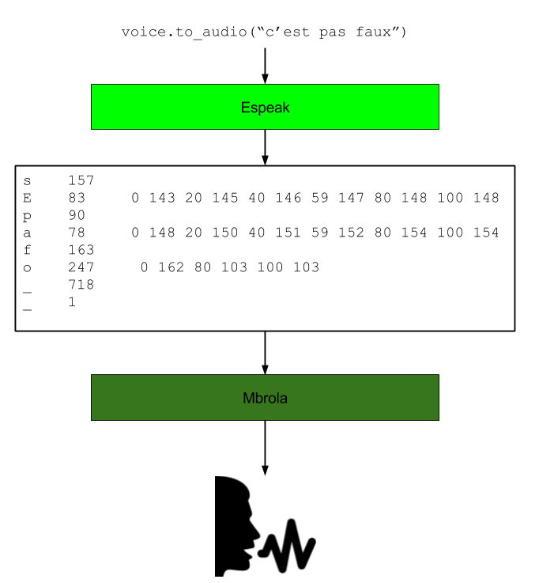

An introduction to Voxpopuli
============================

.. _tutorial:

Tutorial
########

Picking a voice and making it say things
----------------------------------------

The most simple usage of this lib is just bare TTS, using a voice and
a text. The rendered audio is returned in a .wav bytes object:

.. code-block:: python

    from voxpopuli import Voice
    voice = Voice(lang="fr")
    wav = voice.to_audio("salut c'est cool")

Evaluating `type(wav)` whould return `bytes`. You can then save the wav using the `wb`
file option

.. code-block:: python

    with open("salut.wav", "wb") as wavfile:
        wavfile.write(wav)

If you wish to hear how it sounds right away, you'll have to make sure you installed pyaudio *via* pip, and then do:

.. code-block:: python

    voice.say("Salut c'est cool")

Ou can also, say, use scipy to get the pcm audio as a `ndarray`:

.. code-block:: python

    import scipy.io.wavfile import read, write
    from io import BytesIO

    rate, wave_array = read(BytesIO(wav))
    reversed = wave_array[::-1] # reversing the sound file
    write("tulas.wav", rate, reversed)

Getting different voices
------------------------

You can set some parameters you can set on the voice, such as language or pitch

.. code-block:: python

    from voxpopuli import Voice
    # really slow fice with high pitch
    voice = Voice(lang="us", pitch=99, speed=40, voice_id=2)
    voice.say("I'm high on helium")

The exhaustive list of parameters is:

- ``lang``, a language code among those available (us, fr, en, es, ...). You can list
  them using ``Voice.list_voice_ids()``.
- ``voice_id``, an integer, used to select the voice id for a language. If not specified,
  the first voice id found for a given language is used.
- ``pitch``, an integer between 0 and 99 (included)
- ``speed``, an integer, in the words per minute. Default and regular speed
  is 160 words-per-minute.
- ``volume``, float ratio applied to the output sample. Some languages have presets
  that our best specialists tested. Otherwise, defaults to 1.

Handling the phonemic form
--------------------------

To render a string of text to audio, the Voice object actually chains espeak's output
to mbrola, who then renders it to audio. Espeak only renders the text to a list of
phonemes (such as the one in the IPA), who then are to be processed by mbrola.
For those who like pictures, here is a diagram of what happens when you run
`voice.to_audio("Hello world")`

How this works is explained in more details in the section :ref:`mbrola-espeak`

Funny thing is, with voxpopuli, you can "intercept" that phoneme list as a
simple object, modify it, and then pass it back to the voice to render it to
audio. For instance, let's make a simple alteration that'll double the
duration for each vowels in an english text.

.. code-block:: python

    from voxpopuli import Voice, BritishEnglishPhonemes

    voice = Voice(lang="en")
    # here's how you get the phonemes list
    phoneme_list = voice.to_phonemes("Now go away or I will taunt you a second time.")
    for phoneme in phoneme_list: # a PhonemeList instance works mostly like a regular list object
        if phoneme.name in BritishEnglishPhonemes.VOWELS:
            phoneme.duration *= 3

    # rendering and saving the sound, then saying it out loud:
    voice.to_audio(phoneme_list, "modified.wav")
    voice.say(phoneme_list)

.. note::

 * For French, Spanish, German and Italian, the phoneme codes
   used by espeak and mbrola are available as class attributes similar to the ``BritishEnglishPhonemes`` class as above.
 * More info on the phonemes can be found here: `SAMPA page <http://www.phon.ucl.ac.uk/home/sampa/>`_

FAQ/Miscellaneous Examples
##########################

Here is a miscellaneous list of things that you might want to do with Voxpopuli.
If something seems to be obviously missing from this list, don't hesitate
and post an issue on the `the package's github page <https://github.com/hadware/voxpopuli/issues/>`_.

Listing all avalaible voices
----------------------------

You can list all available voices for all languages on your current installation
of voxpopuli this way:

.. code-block:: python

    >>> from voxpopuli import Voice
    >>> print(Voice.list_voice_ids())
    {'de': ['1', '3', '5', '8', '4', '7', '2', '6'],
     'en': ['1'],
     'fr': ['7', '2', '1', '3', '4', '6', '5'],
     'it': ['3', '1', '2', '4']}

You can also directly get all the available voices instances for a particular language:

.. code-block:: python

    >>> it_voices = Voices.get_voices_for_lang("it")
    >>> it_voices[0].say("buongiorno ragazzi!")

Using Voxpopuli as a phonemizer
-------------------------------

Although there are packages that are specialized in that regard
(such as `phonemizer <https://github.com/bootphon/phonemizer>`_), ``voxpopuli``
can be used as a simple phonemizer.

.. code-block:: python

    >>> phoneme_list = Voice(lang="es").to_phonemes("Hola mi amigos, donde esta la biblioteca?")
    >>> [pho.name for pho in phoneme_list]
    ['o', 'l', 'a', 'm', 'i', 'a', 'm', 'i', 'g', 'o', 's', '_', '_', 'd',
     'o', 'n', 'd', 'e', 'e', 's', 't', 'a', 'l', 'a', 'b', 'i', 'b', 'l',
     'i', 'o', 't', 'e', 'k', 'a', '_', '_', '_', '_']

